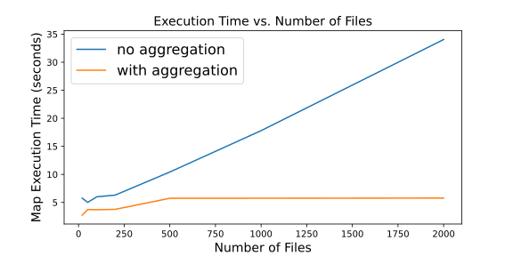

# SmallFilesMapReduce
## Abstract
In this paper, the problem of small files and possible solutions is discussed in the framework of HDFS and object storage. The existing solutions and their limitations are discussed. An algorithm to detect the need of compacting data files and perform the aggregation is proposed, and a prototype code of a MapReduceEngine is reviewed.

## Motivation and Background
MapReduce is a software framework that allows processing vast amounts of data in parallel on large clusters in a fast, reliable and fault-tolerant manner. It operates on key value pairs and produces pairs of different types. The mapper function converts key/value pairs into intermediate records. The number of mappers is based on the size of the input, usually each mapper is assigned a fixed size chunck\block of data. A reducer reduces a set of intermediate values which share a key to a smaller set of values. An intermediate shuffle step is necessary between the mappers and the reducers, in order to fetch the partition of the mappers output that is relevant to each reducer. Increasing the number of reduces increases the framework overhead, but increases load balancing and lowers the cost of failures [[5](#bibliography)].</br>
The input data, intermediate records and output of the MapReduce is usually persisted in Hadoop Distributed File System (HDFS). It is highly fault-tolerant and is designed to handle large data sets, typically gigabyte to terabyte in size. HDFS has master\slave architecture, where each cluster consists of a single NameNod (file system manager\master) and multiple DataNodes, one per node, that store blocks of data and serve read\write requests from the client, and create\delete\replication instructions from the NameNode. The NameNode keeps all the files metadata and monitors the DataNodes health (Heartbeat). Files in HDFS are write-once, they are stored as a sequence of blocks of a fixed size and are replicated for fault tolerance.[[6](#bibliography)]</br>
Hadoop implementation of MapReduce on HDFS relies on bringing the computing resource to the data, as opposed to moving the data from storage to computation cluster via the network. The disadvantage in this architecture is that the storage and compute resources can only be scaled together and not apart. When network bandwidth is not a bottleneck, MapReduce can be implemented on an object storage system. Object storage is a scalable storage solution for unstructured data that is based HTTP\REST API, each object has a unique URI. Like HDFS, the data is replicated between different servers. In contrast to HDFS, obejct storage does not require a client and can be easily accessed. Most importantly, object storage allows to scale the computational resources and to avoid increasing storage cost.[[7](#bibliography)]

## Small Files Problem
When it comes to files that are significantly smaller than the HDFS block size, which is 64MB by default, the system is not efficient. As there is only one NameNode in Hadoop, the files metadata (which weighs more if there are more replications) is centralized and has to be kept in memory. This poses a bottleneck for metadata requests, and a larger number of files and replications results in lower performance of metadata related requests. Another problem is the amount of block reports from DataNodes that make each Heartbeat from DataNode to NameNode a significant event in terms of cluster overhead. The small files is also an issue for MapReduce programs where a lot of processes are created with additional overhead to the program.[[3](#bibliography)] Today, existing solutions to the problem in HDFS requires to avoid persisting small files in HDFS by aggregating small files into blocks. Hadoop suggests Hadoop Archive (HAR) file layout that consists of a masterindex, index and the data file including all the small files.[[1]](#bibliography) HAR files helped overcome the NameNode issue, however the processing performance of reading from the archived file has worsened and so HAR files should be used when data is stored for achival purposses [[2]](#bibliography). An example for a more efficient layout for small files is the Sequence Files, ,where theh small files are stored along their key one by one in a block. The process of creating Sequence files from small files can be parellilzed and become efficient. The disadvantage of sequence files are the immutabilty of the Hadoop files. Since files can't be appended to, it is necessary to ingest a large number of small files at a time in order to make the sequence file reduction efficient. A further optimization to sequence files is to index them in a table, which is called HBase, and is a good solution for random access read [[4]]($bibliography).
## Our Approach
We purpose two possible solutions, each a pluggable framework based on current Hadoop MapReduce.
1. To create a storage API that nips the small files problem in the bud and caches small files from client in memory to create aggregated larger files in storage, such as SequenceFiles. This solution is not applicable when the data that needs processing is already in storage, which is not something that can always be controlled by the user.
2. To add a partitioner step before the mappers that sends multiple keys and files for each mapper process. This solution is effective with object storage where the small files problem is reduced to the overhead created by the number of mappers (as opposed to HDFS storage where it is also a problem of efficiency in storing the data).</br></br>
   
Each method solves the small files problem in MapReduce in terms of processes overhead. The first method is more constrained since it requires access to the data collection process, however it also addresses the HDFS storage small files problems. The first method can be more effective in systems where the bottleneck is network, and the second method is more cost-effective otherwise.
We implemented the second solution and were able to decrease the running time of the map step drastically, as can be seen in this graph:

Our solution ("with aggregation") is not affected drastically as the mapper per key ("no aggregation") method, by the increase in the number of files.<div style="page-break-after: always;"></div>

## Prototype Design
We propose a design for partition step. </br>
The whole mapReduceEngine is available on [github](https://github.com/netta-br/SmallFilesMapReduce)
### Working Assumptions:</br>
 1. Large files are divided into chunks in the data pre-processing step, so the files in the object storage have size which is equal or smaller than the chunk size.
 2. There is no hard constraint on the mappers memory to process partitions that are greater than the chunk size (Though we create an upper bound of 2 times the chunk size).

### Algorithm
```python
PROGRAM partitioner(container):
    partitions = []
    cur = []
    batch_size = 0
    for cloud_object in container:
        if batch_size < chunk_size:
            cur.append(cloud_object.key)
            batch_size += cloud_object.size
        else:
            partitions.append(cur)
            cur = [cloud_object.key]
            batch_size = cloud_object.size
    if cur:
        partitions.append(cur)
    return partitions   
```
The partitions created are of size between 1-2 chunk sizes. Since object storage allows to head a container, it is possible to receive all of the container objects keys and sizes with one query and to create the partitions based on that meta-data alone. The resulting partitions are list of object keys for the mappers. Each map function is decorated with applying it to all keys in the partition one by one, and aggregating the results. 

```python
PROGRAM mapperDecorator(map_function)
    def mapper_function(keys):
        result = []
        for key in keys:
            result.extend(map_function(key))
        return result
    return mapper_function
```

## Next Steps
The partitioner solution can be extended to multiple partiotioners that parellilize that step so that it will be more efficient than running linearly on all of the objects in the conatiner, and each partition that is created can invoke a mapper. To make this solution fault tolerant there needs to be some coordinator node that receives job state from all partitioners and is able to revoke partitioners if necessary (so that if some partitioner fails, that input won't be lost from the process) and to invoke the shuffle step once all partitioners and mappers are finished.
The porposed solution is still vulnerable to the consistency of the list keys in bucket operation. Since object storage list operations are eventually consistent this can be fixed by making sure there is a few minutes separating the creation of the files in object storage and the partition step.
## Conclusion
We descrirbed MapReduce, it's implementation with HDFS and object storage and the difference between them. We defined the Small Files problem in HDFS anad MapReduce and summarized the state of the art. We suggested two solutions to the Small Files problem in MapReduce. We implemented the most general one and succesfully decreased the running time of the mapping step. We suggested ways to further improve the solution to increase it's consistency and fault-tolerance.
## Bibliography
1. [SFMapReduce: An Optimized MapReduce Framework for Small Files](https://www.cs.fsu.edu/~yuw/pubs/2015-NAS-Yu.pdf)
2. [Impact of Small Files on Hadoop Performance: Literature Survey and Open Points](https://mjeer.journals.ekb.eg/article_62728_c818f3f951476c6005647f9ba7364efd.pdf)
3. [An optimized approach for storing and accessing small files on cloud storage](https://www.cs.bham.ac.uk/~rza/pub/cloudStorage.pdf)
4. [Cloudera Blog - The Small Files Problem](https://blog.cloudera.com/the-small-files-problem/)
5. [Hadoop Documentation - MapReduce Tutorial](https://hadoop.apache.org/docs/r1.2.1/mapred_tutorial.html)
6. [Hadoopp Documentation - HDFS Design](https://hadoop.apache.org/docs/r1.2.1/hdfs_design.html#Introduction)
7. [IBM - The Future of Object Storage: From a Data Dump to a Data Lake](https://www.ibm.com/cloud/blog/the-future-of-object-storage-from-a-data-dump-to-a-data-lake)